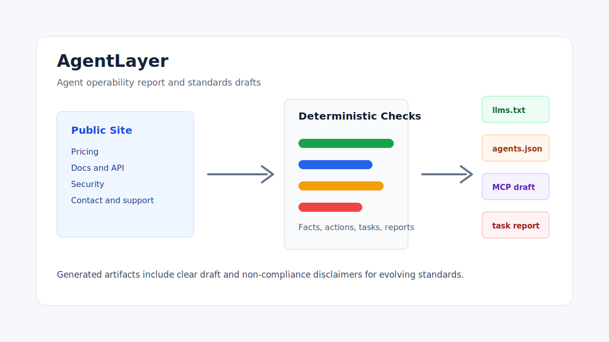
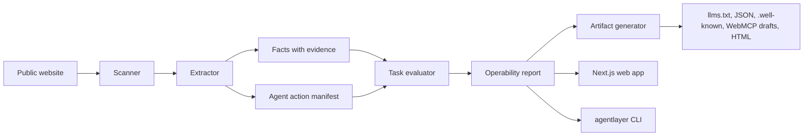

# AgentLayer

SEO made websites discoverable. AgentLayer makes websites operable by AI agents.

[English](./README.md) | [简体中文](./README.zh-CN.md)


AgentLayer is an open-source, deterministic toolkit for checking whether a public website can be
read, trusted, and operated by AI agents. It scans public pages, extracts sourced facts, identifies
action paths, runs task checks, and generates draft artifacts you can review before publishing.

For developers, AgentLayer provides a TypeScript core package, an npm alpha CLI, and a Next.js demo
app. For founders and site owners, it turns "will agents understand my site?" into a concrete
report: missing facts, unclear policies, weak action paths, and task failures.

## Release Status

The current source version is `0.2.0-alpha.2`. It is an alpha release for trying AgentLayer on
public websites and local baseline/compare workflows.

Alpha packages are published as `@junyi5910/agentlayer-core` and `@junyi5910/agentlayer-cli`. The
`@agentlayer` org scope is still planned; this alpha uses the `@junyi5910` scope because npm
rejected org creation and support needs to unlock it.

Run the CLI without installing it globally:

```bash
pnpm dlx @junyi5910/agentlayer-cli generate https://your-site.com --out ./agentlayer-output --max-pages 20
```

Generated artifacts are drafts. Review facts, actions, policies, and standards-related files before
publishing them on a production site.

## At a Glance

| Area          | What AgentLayer does                                                                       |
| ------------- | ------------------------------------------------------------------------------------------ |
| Readability   | Crawls bounded public pages and creates agent-facing Markdown alternatives.                |
| Trustability  | Extracts sourced facts with confidence, review notes, and stable output files.             |
| Actionability | Identifies action paths, form boundaries, policy pages, and conservative manifests.        |
| Task success  | Runs deterministic B2B SaaS task checks and writes `tasks-report.json` plus `report.html`. |

## Demo / Screenshot



The fastest way to see AgentLayer is the live read-only demo:

[Open the AgentLayer read-only demo](https://agentlayer-readonly-demo.vercel.app)

Hosted demo uses the AcmeFlow fixture. Run the CLI locally for real sites.

To run the local demo report:

```bash
pnpm install
pnpm build
pnpm dev
```

Open `http://localhost:3000/demo` to inspect the fixture report UI.

For a full scan, start the AcmeFlow fixture in another terminal, generate artifacts, and open the
generated `report.html`:

```bash
pnpm dev:example
pnpm dlx @junyi5910/agentlayer-cli generate http://localhost:3001 --out ./agentlayer-output --max-pages 20 --allow-local
```

The preview above is the current generated artifact preview and is safe to render directly on
GitHub. Use `docs/assets/agentlayer-preview.svg` as the launch social preview, or capture a fresh
screenshot from `https://agentlayer-readonly-demo.vercel.app`.

## Who Should Use This?

AgentLayer is for:

- Developers adding agent-readable files and reports to a public site.
- Founders and site owners checking whether agents can understand pricing, docs, security, support,
  and contact paths.
- Platform and growth teams preparing for AI agents that read websites on behalf of users.
- Standards-curious teams experimenting with `llms.txt`, MCP/WebMCP-style metadata, API catalogs,
  and agent-facing Markdown snapshots.

## What It Does

AgentLayer scans public pages within same-host, max-page, timeout, and robots.txt bounds. It
extracts agent-relevant structure, generates conservative machine-readable files, detects possible
actions, and evaluates deterministic B2B SaaS tasks such as finding pricing, docs, security
information, integrations, support, and demo/contact paths.

This is not an AI SEO dashboard and not only an `llms.txt` generator. It is closer to Lighthouse for
the agentic web: standards matter, but AgentLayer also asks whether agents can complete useful
tasks.

## What AgentLayer Is Not

- Not a crawler API.
- Not an AI SEO rank tracker.
- Not a compliance guarantee for MCP, WebMCP, `llms.txt`, or future standards.
- Not browser automation, and it does not click through flows or submit forms.

## AgentLayer vs Firecrawl.

Firecrawl is excellent when you need hosted crawling and clean content extraction for LLM ingestion.
AgentLayer is focused on a different layer: agent operability. It checks whether a website exposes
sourced facts, clear policies, action boundaries, task paths, and standards-ready draft artifacts.

You can use them together: Firecrawl can help collect content, while AgentLayer evaluates and
packages agent-facing outputs. AgentLayer does not require Firecrawl today. See
[docs/integrations/firecrawl.md](./docs/integrations/firecrawl.md).

## Why Now

AI agents increasingly read and operate websites on behalf of users. Most sites are optimized for
humans and search engines, not for agents that need sourced facts, clear policies, action
boundaries, and machine-readable alternatives.

Standards and conventions such as `llms.txt`, MCP, WebMCP, Agent Skills, and API catalogs are
emerging. Site owners need tooling that helps them implement and test agent operability without
inventing claims or submitting forms.

## Generated Outputs

AgentLayer can generate:

- `llms.txt`
- `llms-full.txt`
- Markdown snapshots for important pages
- `site-profile.json`
- `facts.json` with source URLs and confidence
- `actions.json`
- `form-operability.json`
- `artifacts.json`
- `.well-known/agents.json`
- `.well-known/mcp/server-card.json` draft metadata
- `.well-known/mcp.json` legacy/draft alias
- `.well-known/api-catalog`
- `.well-known/agent-skills/index.json`
- `webmcp/suggested-webmcp-tools.json`
- `webmcp/suggested-form-annotations.md`
- `tasks-report.json`
- `recommendations.json`
- `report.html`

Generated MCP/WebMCP/action files are conservative suggestions. They are not official compliance
claims.

See [docs/standards.md](./docs/standards.md) for the current draft posture on `llms.txt`, MCP Server
Card drafts, API Catalog, Agent Skills, WebMCP, and Markdown alternatives.

## Quickstart

Scan a public website and generate draft artifacts:

```bash
pnpm dlx @junyi5910/agentlayer-cli generate https://your-site.com --out ./agentlayer-output --max-pages 20
```

Open `./agentlayer-output/report.html` to review the report. Treat generated files as drafts: review
sourced facts, action boundaries, and MCP/WebMCP/API Catalog/Agent Skills suggestions before
publishing anything.

AgentLayer scans bounded public pages. It follows same-host, max-page, timeout, and robots.txt
limits; it does not submit forms, crawl private/authenticated areas, or perform destructive actions.

To run the example SaaS fixture or the local web app from a repository checkout, see
[Development](#development).

## CLI Usage

Recommended alpha command:

```bash
pnpm dlx @junyi5910/agentlayer-cli generate https://your-site.com --out ./agentlayer-output --max-pages 20
```

For a first real-site trial:

```bash
pnpm dlx @junyi5910/agentlayer-cli generate https://example.com --out ./agentlayer-output --max-pages 20
pnpm dlx @junyi5910/agentlayer-cli doctor https://example.com --max-pages 20
```

Additional commands:

```bash
pnpm dlx @junyi5910/agentlayer-cli scan https://example.com --out ./agentlayer-output --max-pages 20
pnpm dlx @junyi5910/agentlayer-cli test https://example.com --out ./agentlayer-report.json
pnpm dlx @junyi5910/agentlayer-cli init-fixture --out ./agentlayer-output/tasks
```

`init-fixture` writes `b2b-saas.default.json` into the output directory unless you pass a `.json`
file path. It refuses to overwrite an existing task suite unless you add `--force`.

When the CLI is installed or linked as the `agentlayer` binary, use the same commands without
`pnpm`:

```bash
agentlayer generate https://example.com --out ./agentlayer-output --max-pages 20
agentlayer doctor https://example.com --max-pages 20
```

The bare `agentlayer` npm package name is not this repository. Use the scoped package
`@junyi5910/agentlayer-cli`.

## AgentLayer CI alpha

AgentLayer CI v0.2.0-alpha.1 adds the first local baseline/compare workflow for making
agent-operability changes reviewable in pull requests. Generate a baseline JSON report for a known
target, then run compare on later scans to flag task regressions, missing artifacts, and optional
score drops. The commands are available now, but the workflow is still alpha.

See [docs/ci.md](./docs/ci.md) for local baseline/compare usage and the GitHub Actions alpha
workflow.

Example baseline, passing comparison, and failing comparison outputs live in
[examples/ci](./examples/ci).

## Help us test real websites

AgentLayer needs scans from real public websites to improve the default heuristics. If you can share
a result, comment on
[the pinned scan feedback issue](https://github.com/Qqqq5910/agentlayer/issues/1) or use
[docs/feedback.md](./docs/feedback.md) with:

- URL
- command
- overall score
- wrong facts/actions
- confusing recommendations
- artifacts you would publish

## Web App

The Next.js app includes:

- URL scanner page
- Internal scan API route
- Stored report route
- Demo report page using fixture data
- Docs page explaining generated files

No login, hosted database, payment flow, or LLM API key is required.

## Launch Checklist

Before publishing generated artifacts on a production site:

- Review `facts.json`, `actions.json`, and `tasks-report.json`.
- Keep draft/non-compliance disclaimers in MCP, WebMCP, API Catalog, and Agent Skills files.
- Confirm sensitive actions require human confirmation.
- Serve approved files from stable paths such as `/llms.txt` and `/.well-known/agents.json`.
- Re-run AgentLayer after changes to navigation, pricing, docs, support, policies, security pages,
  or API docs.
- Add generated artifacts to normal release review, not only one-time setup.

## Example Report

`apps/example-saas-site` is a fictional B2B SaaS site called AcmeFlow. It includes pricing, docs,
API docs, security, integrations, contact sales, book demo, privacy, terms, support, and customer
pages. Use it as the local fixture for scanner demos and tests.

## Architecture



## Scoring Model

Overall Agent Operability Score is a weighted average:

- Readability: 25%
- Trustability: 25%
- Actionability: 30%
- Task success: 20%

The evaluator is deterministic. It uses discovered pages, headings, links, forms, extracted facts,
actions, and text snippets. It does not require an LLM by default.

See [docs/scoring.md](./docs/scoring.md) for the public alpha scoring guide, task-check behavior,
recommendation severities, limitations, and rerun workflow.

## v0.2 Alpha Limitations

- Extraction is heuristic and conservative.
- AgentLayer does not guarantee compliance with MCP, WebMCP, or any future standard.
- Generated artifacts and manifests are drafts that must be reviewed before production use.
- Crawls are bounded by same-host links, `maxPages`, request timeouts, and robots.txt guidance.
- The scanner does not submit forms.
- The scanner does not crawl authenticated or private areas.
- The scanner does not perform destructive actions.
- Remote sites can block crawling; AgentLayer reports those failures rather than bypassing them.
- Task checks are tuned for B2B SaaS-style public websites.

## Roadmap

- WordPress plugin
- Webflow plugin
- Shopify adapter
- Next.js middleware
- Cloudflare Worker
- Real WebMCP integration
- MCP server implementation
- LLM judge plugin
- Browser-agent task replay
- Hosted SaaS version

## Development

Use repo-local commands when running from a repository checkout:

```bash
pnpm install
pnpm lint
pnpm typecheck
pnpm test
pnpm build
```

Start the example SaaS site:

```bash
pnpm dev:example
```

In another terminal, scan the fixture with the repo-local CLI:

```bash
pnpm agentlayer generate http://localhost:3001 --out ./agentlayer-output --max-pages 20 --allow-local
pnpm agentlayer doctor http://localhost:3001 --max-pages 20 --allow-local
```

Optionally run the local web app:

```bash
pnpm dev
```

The web app runs at `http://localhost:3000`. The AcmeFlow fixture runs at `http://localhost:3001`.

GitHub Actions runs the same lint, typecheck, test, and build commands on pushes and pull requests.

## Documentation

- [Scoring guide](./docs/scoring.md)
- [Standards](./docs/standards.md)
- [AgentLayer CI alpha](./docs/ci.md)
- [Release checklist](./docs/release-checklist.md)
- [Feedback guide](./docs/feedback.md)
- [Pinned scan feedback issue](https://github.com/Qqqq5910/agentlayer/issues/1)
- [Launch posts](./docs/launch/launch-posts.md)
- [Launch outreach tracker](./docs/launch/outreach-tracker.md)
- [GitHub metadata](./docs/launch/github-metadata.md)
- [Share-your-scan issue template](./docs/launch/share-your-scan.md)
- [Security notes](./docs/security.md)
- [Firecrawl integration notes](./docs/integrations/firecrawl.md)
- [Next.js deployment](./docs/deployment/nextjs.md)
- [Cloudflare Workers deployment](./docs/deployment/cloudflare-workers.md)
- [Vercel deployment](./docs/deployment/vercel.md)

## Contributing

See [CONTRIBUTING.md](./CONTRIBUTING.md).

## Security

See [SECURITY.md](./SECURITY.md).

## License

MIT. See [LICENSE](./LICENSE).
