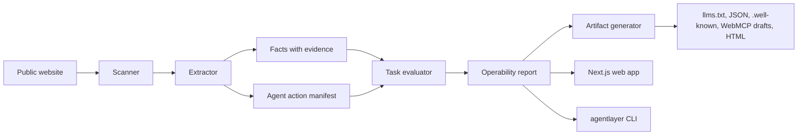

# AgentLayer

SEO made websites discoverable. AgentLayer makes websites operable by AI agents.


AgentLayer is an open-source, deterministic toolkit for checking whether a public website can be read, trusted, and operated by AI agents. It scans public pages, extracts sourced facts, identifies action paths, runs task checks, and generates draft artifacts you can review before publishing.

For developers, AgentLayer provides a TypeScript core package, a repo-local CLI, and a Next.js demo app. For founders and site owners, it turns "will agents understand my site?" into a concrete report: missing facts, unclear policies, weak action paths, and task failures.

## What It Does

AgentLayer scans public pages within same-host, max-page, timeout, and robots.txt bounds. It extracts agent-relevant structure, generates conservative machine-readable files, detects possible actions, and evaluates deterministic B2B SaaS tasks such as finding pricing, docs, security information, integrations, support, and demo/contact paths.

This is not an AI SEO dashboard and not only an `llms.txt` generator. It is closer to Lighthouse for the agentic web: standards matter, but AgentLayer also asks whether agents can complete useful tasks.

## Why Now

AI agents increasingly read and operate websites on behalf of users. Most sites are optimized for humans and search engines, not for agents that need sourced facts, clear policies, action boundaries, and machine-readable alternatives.

Standards and conventions such as `llms.txt`, MCP, WebMCP, Agent Skills, and API catalogs are emerging. Site owners need tooling that helps them implement and test agent operability without inventing claims or submitting forms.

## Generated Outputs

AgentLayer can generate:

- `llms.txt`
- `llms-full.txt`
- Markdown snapshots for important pages
- `site-profile.json`
- `facts.json` with source URLs and confidence
- `actions.json`
- `.well-known/agents.json`
- `.well-known/mcp.json` draft metadata
- `.well-known/agent-skills/index.json`
- `webmcp/suggested-webmcp-tools.json`
- `webmcp/suggested-form-annotations.md`
- `tasks-report.json`
- `recommendations.json`
- `report.html`

Generated MCP/WebMCP/action files are conservative suggestions. They are not official compliance claims.

## Quickstart

Start the example SaaS site:

```bash
pnpm install
pnpm build
pnpm dev:example
```

In another terminal, scan the fixture and generate artifacts:

```bash
pnpm agentlayer generate http://localhost:3001 --out ./agentlayer-output --max-pages 20
pnpm agentlayer doctor http://localhost:3001 --max-pages 20
```

Optionally run the local web app:

```bash
pnpm dev
```

The web app runs at `http://localhost:3000`. The AcmeFlow fixture runs at `http://localhost:3001`.

## CLI Usage

Use `pnpm agentlayer` when running from a repository checkout:

```bash
pnpm agentlayer scan <url> --out ./agentlayer-output --max-pages 20
pnpm agentlayer generate <url> --out ./agentlayer-output --max-pages 20
pnpm agentlayer test <url> --tasks ./examples/tasks/b2b-saas.default.json --out ./agentlayer-report.json
pnpm agentlayer doctor <url> --max-pages 20
pnpm agentlayer init-fixture --out ./agentlayer-output/tasks
```

`init-fixture` writes `b2b-saas.default.json` into the output directory unless you pass a `.json` file path. It refuses to overwrite an existing task suite unless you add `--force`.

When the CLI is installed or linked as the `agentlayer` binary, use the same commands without `pnpm`:

```bash
agentlayer scan https://example.com --out ./agentlayer-output --max-pages 20
```

## Web App

The Next.js app includes:

- URL scanner page
- Internal scan API route
- Stored report route
- Demo report page using fixture data
- Docs page explaining generated files

No login, hosted database, payment flow, or LLM API key is required.

## Example Report

`apps/example-saas-site` is a fictional B2B SaaS site called AcmeFlow. It includes pricing, docs, API docs, security, integrations, contact sales, book demo, privacy, terms, support, and customer pages. Use it as the local fixture for scanner demos and tests.

## Architecture



## Scoring Model

Overall Agent Operability Score is a weighted average:

- Readability: 25%
- Trustability: 25%
- Actionability: 30%
- Task success: 20%

The evaluator is deterministic. It uses discovered pages, headings, links, forms, extracted facts, actions, and text snippets. It does not require an LLM by default.

## Limitations

- Extraction is heuristic and conservative.
- AgentLayer does not guarantee compliance with MCP, WebMCP, or any future standard.
- Generated manifests are suggestions that must be reviewed before production use.
- Crawls are bounded by same-host links, `maxPages`, request timeouts, and robots.txt guidance.
- The scanner does not submit forms.
- The scanner does not crawl authenticated or private areas.
- The scanner does not perform destructive actions.
- Remote sites can block crawling; AgentLayer reports those failures rather than bypassing them.

## Roadmap

- WordPress plugin
- Webflow plugin
- Shopify adapter
- Next.js middleware
- Cloudflare Worker
- Real WebMCP integration
- MCP server implementation
- LLM judge plugin
- Browser-agent task replay
- Hosted SaaS version

## Development

```bash
pnpm install
pnpm lint
pnpm typecheck
pnpm test
pnpm build
```

GitHub Actions runs the same lint, typecheck, test, and build commands on pushes and pull requests.

## Contributing

See [CONTRIBUTING.md](./CONTRIBUTING.md).

## Security

See [SECURITY.md](./SECURITY.md).

## License

MIT. See [LICENSE](./LICENSE).
