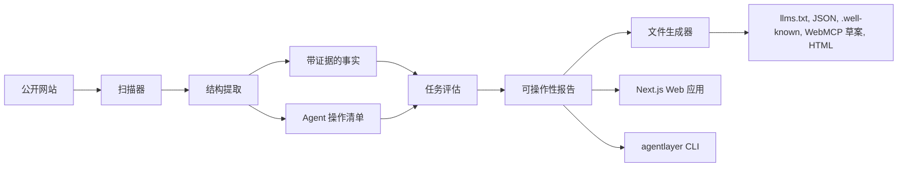

# AgentLayer

SEO 让网站能被搜索引擎发现。AgentLayer 让网站能被 AI Agent 理解、信任和操作。

[English](./README.md) | [简体中文](./README.zh-CN.md)


AgentLayer 是一个开源、确定性的工具包，用来检查公开网站是否能被 AI Agent 读取、信任和操作。

它会：

- 在同站、页数、超时和 robots.txt 限制内扫描公开页面
- 提取带来源证据的事实
- 识别可操作路径
- 运行任务检查
- 生成可人工审阅后再发布的草案文件

对开发者来说，AgentLayer 提供 TypeScript core 包、npm alpha CLI 和 Next.js 演示应用。

对创始人和网站所有者来说，它把“Agent 能不能看懂我的网站？”变成一份具体报告：

- 缺少哪些事实
- 哪些政策不清楚
- 哪些操作路径薄弱
- 哪些任务失败

## 发布状态

当前源码版本是 `0.2.0-alpha.1`。这是用于公开网站试用和本地 baseline/compare 工作流的 alpha 版本。

Alpha 包发布为 `@junyi5910/agentlayer-core` 和 `@junyi5910/agentlayer-cli`。`@agentlayer` org
scope 仍计划保留；当前 alpha 使用 `@junyi5910` scope，因为 npm org 创建被拒，需要 support 解锁。

无需全局安装，可以直接运行 CLI：

```bash
pnpm dlx @junyi5910/agentlayer-cli generate https://your-site.com --out ./agentlayer-output --max-pages 20
```

生成文件都是草案。发布到生产站点前，请先审阅事实、操作、政策和标准相关文件。

## 快速了解

| 维度          | AgentLayer 做什么                                                             |
| ------------- | ----------------------------------------------------------------------------- |
| Readability   | 有边界地扫描公开页面，并生成面向 Agent 的 Markdown 替代内容。                 |
| Trustability  | 提取带来源、置信度和审阅提示的事实，并写入稳定输出文件。                      |
| Actionability | 识别操作路径、表单边界、政策页面和保守的 action manifests。                   |
| Task success  | 运行确定性的 B2B SaaS 任务检查，并生成 `tasks-report.json` 和 `report.html`。 |

## Demo 和截图


最快的体验方式是打开在线只读 demo：

[打开 AgentLayer 只读 demo](https://agentlayer-readonly-demo.vercel.app)

这个在线 demo 只读且只使用 AcmeFlow fixture。扫描真实站点时，请在本地运行 CLI。

如果想在本地打开 demo report：

```bash
pnpm install
pnpm build
pnpm dev
```

然后访问 `http://localhost:3000/demo` 查看 fixture report UI。

如果想跑完整扫描，可以在另一个终端启动 AcmeFlow fixture，再生成文件并打开输出目录中的
`report.html`：

```bash
pnpm dev:example
pnpm dlx @junyi5910/agentlayer-cli generate http://localhost:3001 --out ./agentlayer-output --max-pages 20 --allow-local
```

上方图片是当前生成文件预览，可以直接在 GitHub 上渲染。发布前可以使用
`docs/assets/agentlayer-preview.svg` 作为 social preview，也可以从
`https://agentlayer-readonly-demo.vercel.app` 重新截取一张 demo 截图。

## 谁适合使用？

AgentLayer 适合：

- 想给公开网站补充 Agent-readable 文件和报告的开发者。
- 想检查 Agent 能否理解定价、文档、安全、支持和联系路径的创始人或网站所有者。
- 正在为 AI Agent 代用户访问网站做准备的平台、增长和产品团队。
- 正在实验 `llms.txt`、MCP/WebMCP 风格元数据、API catalogs 和 Agent-facing Markdown 快照的团队。

它不是 AI SEO 面板，也不是单纯的 `llms.txt` 生成器。

更准确地说，AgentLayer 像面向 Agentic
Web 的 Lighthouse：不只看你有没有某个标准文件，也看 Agent 能不能真的：

- 找到定价
- 读懂产品
- 找到文档
- 联系销售
- 识别政策
- 完成关键路径

## AgentLayer 不是什么

- 不是 crawler API。
- 不是 AI SEO 排名追踪工具。
- 不是 MCP、WebMCP、`llms.txt` 或未来标准的合规保证。
- 不是浏览器自动化工具，不会点击流程或提交表单。

## AgentLayer vs Firecrawl.

Firecrawl 更适合做托管爬取和把网页转成适合 LLM 使用的内容。

AgentLayer 关注的是另一层：网站对 Agent 是否“可操作”。它会检查：

- 事实来源
- 政策清晰度
- 操作边界
- 任务路径
- 可审阅后发布的标准草案文件

两者可以组合使用：Firecrawl 负责内容采集，AgentLayer 负责评估和打包 Agent-facing 输出。AgentLayer 目前不依赖 Firecrawl。更多见
[docs/integrations/firecrawl.md](./docs/integrations/firecrawl.md)。

## 为什么现在需要它

越来越多用户会通过 ChatGPT Agent、Claude、Gemini、浏览器 Agent 或 MCP 工具访问网站。

过去的网站主要为人和搜索引擎优化，但 Agent 需要的是另一套东西：

- 清晰结构
- 可验证事实
- 来源链接
- 边界明确的操作清单
- 机器可读的内容快照

`llms.txt`、MCP、WebMCP、Agent Skills、API
catalog 等方向正在出现。网站所有者需要一个工具，帮助自己把网站改造成对 Agent 友好，同时避免夸大声明和危险操作。

## AgentLayer 会生成什么

- `llms.txt`
- `llms-full.txt`
- 重要页面的 Markdown 快照
- `site-profile.json`
- 带来源和置信度的 `facts.json`
- `actions.json`
- `form-operability.json`
- `artifacts.json`
- `.well-known/agents.json`
- `.well-known/mcp/server-card.json` 草案
- `.well-known/mcp.json` legacy/draft alias
- `.well-known/api-catalog`
- `.well-known/agent-skills/index.json`
- `webmcp/suggested-webmcp-tools.json`
- `webmcp/suggested-form-annotations.md`
- `tasks-report.json`
- `recommendations.json`
- `report.html`

这些文件默认是保守建议，不会替网站伪造合规声明，也不会声称已经正式实现某个还在演进的标准。

标准相关说明见 [docs/standards.md](./docs/standards.md)，包括 `llms.txt`、MCP Server Card 草案、API
Catalog、Agent Skills、WebMCP 和 Markdown 替代页。

## 快速开始

扫描一个公开网站并生成草案文件：

```bash
pnpm dlx @junyi5910/agentlayer-cli generate https://your-site.com --out ./agentlayer-output --max-pages 20
```

打开 `./agentlayer-output/report.html`
查看报告。所有生成文件都应视为草案：发布前请审阅带来源的事实、操作边界，以及 MCP/WebMCP/API
Catalog/Agent Skills 建议。

AgentLayer 只扫描有边界的公开页面。它遵守同站、页数、超时和 robots.txt 限制；不会提交表单，不会爬取私有或需要登录的区域，也不会执行破坏性操作。

如果要从仓库 checkout 中运行示例 SaaS fixture 或本地 Web 应用，请看[开发](#开发)。

## CLI

推荐的 alpha 命令：

```bash
pnpm dlx @junyi5910/agentlayer-cli generate https://your-site.com --out ./agentlayer-output --max-pages 20
```

第一次扫描真实网站建议使用：

```bash
pnpm dlx @junyi5910/agentlayer-cli generate https://example.com --out ./agentlayer-output --max-pages 20
pnpm dlx @junyi5910/agentlayer-cli doctor https://example.com --max-pages 20
```

其他命令：

```bash
pnpm dlx @junyi5910/agentlayer-cli scan https://example.com --out ./agentlayer-output --max-pages 20
pnpm dlx @junyi5910/agentlayer-cli test https://example.com --out ./agentlayer-report.json
pnpm dlx @junyi5910/agentlayer-cli init-fixture --out ./agentlayer-output/tasks
```

`init-fixture` 会把 `b2b-saas.default.json` 写入输出目录；如果传入 `.json`
路径，则写入该文件。它默认不会覆盖已有任务集，除非加 `--force`。

如果已经把 CLI 安装或 link 成 `agentlayer` 可执行命令，可以去掉 `pnpm`：

```bash
agentlayer generate https://example.com --out ./agentlayer-output --max-pages 20
agentlayer doctor https://example.com --max-pages 20
```

裸名 `agentlayer` npm 包不是本仓库。请使用 scoped package：`@junyi5910/agentlayer-cli`。

## AgentLayer CI alpha

AgentLayer CI v0.2.0-alpha.1 是第一版 local-first
baseline/compare 工作流，用来让 agent-operability 的变化可以进入 pull
request 审查。你可以为一个已知目标生成 baseline
JSON，之后用 compare 检查任务回归、缺失生成文件，以及可选的分数下降。

这些命令已经可用，但仍是 alpha；它不是托管 CI 服务，也不是正式合规保证。用法和 GitHub Actions
alpha 示例见 [docs/ci.md](./docs/ci.md)。

示例 baseline、通过的 comparison、失败的 comparison 输出在 [examples/ci](./examples/ci)。

## 帮我们测试真实网站

AgentLayer 需要更多真实公开网站的扫描结果来改进默认启发式规则。如果你愿意分享结果，可以开 issue，或按
[docs/feedback.md](./docs/feedback.md) 提供：

- URL
- command
- overall score
- wrong facts/actions
- confusing recommendations
- artifacts you would publish

## Web 应用

Next.js 应用目前包含：

- URL 扫描页面
- 内部 scan API route
- 已存报告 route
- 使用 fixture 数据的 demo report 页面
- 解释生成文件的 docs 页面

不需要登录、托管数据库、支付流程或 LLM API key。

## 上线检查清单

生产站点发布生成文件前：

- 审阅 `facts.json`、`actions.json` 和 `tasks-report.json`。
- 保留 MCP、WebMCP、API Catalog、Agent Skills 文件里的 draft/non-compliance 提示。
- 确认敏感操作需要人工确认。
- 从稳定路径发布已审阅文件，例如 `/llms.txt` 和 `/.well-known/agents.json`。
- 导航、定价、文档、支持、政策、安全页或 API 文档变化后重新运行 AgentLayer。
- 把生成文件纳入常规发布审查，而不是一次性配置。

## 示例站点

`apps/example-saas-site` 是一个虚构的 B2B SaaS 网站 AcmeFlow。

它包含：

- 产品首页
- 定价
- 文档
- API 文档
- 安全
- 集成
- 联系销售
- 预约 demo
- 隐私政策
- 服务条款
- 支持
- 客户案例页面

这个站点用于本地扫描、测试和演示。

## 架构



## 评分

总分是加权平均：

- Readability：25%
- Trustability：25%
- Actionability：30%
- Task success：20%

默认评估是确定性的，不依赖 LLM
API。它会根据页面、标题、链接、表单、事实、操作和文本证据来判断任务是否 pass、partial 或 fail。

公开 alpha 的评分说明、任务检查、推荐级别、限制和修复后重新运行流程见
[docs/scoring.md](./docs/scoring.md)。

## v0.2 Alpha 限制

- 提取逻辑是启发式的，会保持保守。
- AgentLayer 不保证 MCP、WebMCP 或任何未来标准的正式合规。
- 生成的 artifact、action/MCP/WebMCP 文件都是草案，需要人工审阅后才能上线。
- 爬取受同站链接、`maxPages`、请求超时和 robots.txt 指引限制。
- 扫描器不会提交表单。
- 扫描器不会绕过登录、鉴权或私有区域。
- 扫描器不会执行破坏性操作。
- 如果远程站点阻止爬取，AgentLayer 会报告失败原因，而不是绕过限制。
- 任务检查主要面向 B2B SaaS 风格的公开网站。

## 路线图

- WordPress 插件
- Webflow 插件
- Shopify adapter
- Next.js middleware
- Cloudflare Worker
- 真正的 WebMCP 集成
- MCP server 实现
- LLM judge 插件
- 浏览器 Agent 任务回放
- 托管版 SaaS

## 开发

在仓库 checkout 中开发时使用 repo-local 命令：

```bash
pnpm install
pnpm lint
pnpm typecheck
pnpm test
pnpm build
```

启动示例 SaaS 站点：

```bash
pnpm dev:example
```

另开一个终端，用 repo-local CLI 扫描 fixture：

```bash
pnpm agentlayer generate http://localhost:3001 --out ./agentlayer-output --max-pages 20 --allow-local
pnpm agentlayer doctor http://localhost:3001 --max-pages 20 --allow-local
```

可选：运行本地 Web 应用：

```bash
pnpm dev
```

Web 应用默认在 `http://localhost:3000`，示例 SaaS 站点 AcmeFlow 默认在 `http://localhost:3001`。

GitHub Actions 会在 push 和 pull request 上运行同样的 lint、typecheck、test 和 build 命令。

## 文档

- [Scoring guide](./docs/scoring.md)
- [Standards](./docs/standards.md)
- [AgentLayer CI alpha](./docs/ci.md)
- [Release checklist](./docs/release-checklist.md)
- [Feedback guide](./docs/feedback.md)
- [Launch posts](./docs/launch/launch-posts.md)
- [GitHub metadata](./docs/launch/github-metadata.md)
- [Share-your-scan issue template](./docs/launch/share-your-scan.md)
- [Security notes](./docs/security.md)
- [Firecrawl integration notes](./docs/integrations/firecrawl.md)
- [Next.js deployment](./docs/deployment/nextjs.md)
- [Cloudflare Workers deployment](./docs/deployment/cloudflare-workers.md)
- [Vercel deployment](./docs/deployment/vercel.md)

## 贡献与安全

请阅读 [CONTRIBUTING.md](./CONTRIBUTING.md) 和 [SECURITY.md](./SECURITY.md)。

## License

MIT，见 [LICENSE](./LICENSE)。
