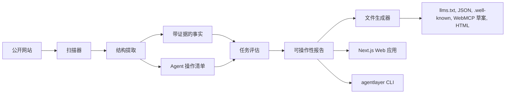

# AgentLayer

SEO 让网站能被搜索引擎发现。AgentLayer 让网站能被 AI Agent 理解、信任和操作。


AgentLayer 是一个开源、确定性的工具包，用来检查公开网站是否能被 AI Agent 读取、信任和操作。它会在同站、页数、超时和 robots.txt 限制内扫描公开页面，提取带来源证据的事实，识别可操作路径，运行任务检查，并生成可人工审阅后再发布的草案文件。

对开发者来说，AgentLayer 提供 TypeScript core 包、仓库内 CLI 和 Next.js 演示应用。对创始人和网站所有者来说，它把“Agent 能不能看懂我的网站？”变成一份具体报告：缺少哪些事实、哪些政策不清楚、哪些操作路径薄弱、哪些任务失败。

它不是 AI SEO 面板，也不是单纯的 `llms.txt` 生成器。更准确地说，AgentLayer 像面向 Agentic Web 的 Lighthouse：不只看你有没有某个标准文件，也看 Agent 能不能真的找到定价、读懂产品、找到文档、联系销售、识别政策和完成关键路径。

## 为什么现在需要它

越来越多用户会通过 ChatGPT Agent、Claude、Gemini、浏览器 Agent 或 MCP 工具访问网站。过去的网站主要为人和搜索引擎优化，但 Agent 需要的是另一套东西：清晰结构、可验证事实、来源链接、边界明确的操作清单，以及机器可读的内容快照。

`llms.txt`、MCP、WebMCP、Agent Skills、API catalog 等方向正在出现。网站所有者需要一个工具，帮助自己把网站改造成对 Agent 友好，同时避免夸大声明和危险操作。

## AgentLayer 会生成什么

- `llms.txt`
- `llms-full.txt`
- 重要页面的 Markdown 快照
- `site-profile.json`
- 带来源和置信度的 `facts.json`
- `actions.json`
- `.well-known/agents.json`
- `.well-known/mcp.json` 草案
- `.well-known/agent-skills/index.json`
- `webmcp/suggested-webmcp-tools.json`
- `webmcp/suggested-form-annotations.md`
- `tasks-report.json`
- `recommendations.json`
- `report.html`

这些文件默认是保守建议，不会替网站伪造合规声明，也不会声称已经正式实现某个还在演进的标准。

## 快速开始

启动示例 SaaS 站点：

```bash
pnpm install
pnpm build
pnpm dev:example
```

另开一个终端，扫描示例站点并生成文件：

```bash
pnpm agentlayer generate http://localhost:3001 --out ./agentlayer-output --max-pages 20
pnpm agentlayer doctor http://localhost:3001 --max-pages 20
```

可选：运行本地 Web 应用：

```bash
pnpm dev
```

Web 应用默认在 `http://localhost:3000`，示例 SaaS 站点 AcmeFlow 默认在 `http://localhost:3001`。

## CLI

在仓库 checkout 中运行 CLI 时，使用 `pnpm agentlayer`：

```bash
pnpm agentlayer scan <url> --out ./agentlayer-output --max-pages 20
pnpm agentlayer generate <url> --out ./agentlayer-output --max-pages 20
pnpm agentlayer test <url> --tasks ./examples/tasks/b2b-saas.default.json --out ./agentlayer-report.json
pnpm agentlayer doctor <url> --max-pages 20
pnpm agentlayer init-fixture --out ./agentlayer-output/tasks
```

`init-fixture` 会把 `b2b-saas.default.json` 写入输出目录；如果传入 `.json` 路径，则写入该文件。它默认不会覆盖已有任务集，除非加 `--force`。

如果已经把 CLI 安装或 link 成 `agentlayer` 可执行命令，可以去掉 `pnpm`：

```bash
agentlayer scan https://example.com --out ./agentlayer-output --max-pages 20
```

## Web 应用

Next.js 应用目前包含：

- URL 扫描页面
- 内部 scan API route
- 已存报告 route
- 使用 fixture 数据的 demo report 页面
- 解释生成文件的 docs 页面

不需要登录、托管数据库、支付流程或 LLM API key。

## 示例站点

`apps/example-saas-site` 是一个虚构的 B2B SaaS 网站 AcmeFlow。它包含产品首页、定价、文档、API 文档、安全、集成、联系销售、预约 demo、隐私政策、服务条款、支持和客户案例页面。这个站点用于本地扫描、测试和演示。

## 架构



## 评分

总分是加权平均：

- Readability：25%
- Trustability：25%
- Actionability：30%
- Task success：20%

默认评估是确定性的，不依赖 LLM API。它会根据页面、标题、链接、表单、事实、操作和文本证据来判断任务是否 pass、partial 或 fail。

## 限制

- 提取逻辑是启发式的，会保持保守。
- AgentLayer 不保证 MCP、WebMCP 或任何未来标准的正式合规。
- 生成的 action/MCP/WebMCP 文件需要人工审阅后才能上线。
- 爬取受同站链接、`maxPages`、请求超时和 robots.txt 指引限制。
- 扫描器不会提交表单。
- 扫描器不会绕过登录、鉴权或私有区域。
- 扫描器不会执行破坏性操作。
- 如果远程站点阻止爬取，AgentLayer 会报告失败原因，而不是绕过限制。

## 路线图

- WordPress 插件
- Webflow 插件
- Shopify adapter
- Next.js middleware
- Cloudflare Worker
- 真正的 WebMCP 集成
- MCP server 实现
- LLM judge 插件
- 浏览器 Agent 任务回放
- 托管版 SaaS

## 开发

```bash
pnpm install
pnpm lint
pnpm typecheck
pnpm test
pnpm build
```

GitHub Actions 会在 push 和 pull request 上运行同样的 lint、typecheck、test 和 build 命令。

## 贡献与安全

请阅读 [CONTRIBUTING.md](./CONTRIBUTING.md) 和 [SECURITY.md](./SECURITY.md)。

## License

MIT，见 [LICENSE](./LICENSE)。
